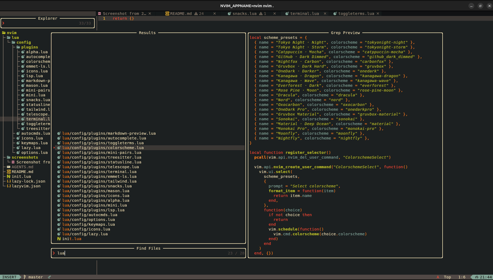

# Personal LazyVim Setup

Modern Neovim configuration built on [LazyVim](https://github.com/LazyVim/LazyVim) with Telescope-driven navigation, Blink completion, and a curated set of language extras for web and systems work.

## Considerations

There might be several tool chains you need to get to get the health checks going, since this a setup that has many of the tooling I use for Rust, TS/JS, Python, LaTeX, Go, etc. You can still customize them to just use what you need.

## Quick shots

## Quick start

- Requires Neovim 0.9+ (0.10 recommended for smooth scrolling) and a Nerd Font (icons enabled via `vim.g.have_nerd_font = true`).
- Back up your existing config, then clone or symlink this repo to `~/.config/nvim`.
- Install plugins and build dependencies: `nvim --headless "+Lazy sync" +qa`.
- Launch `:Mason` after the first start to watch LSPs/formatters install (Angular, Astro, Bash, C/C++, CMake, Docker, Elixir, Elm, Ember, Erlang, Go, Haskell, Helm, JSON, Kotlin, Lua, Markdown, Nix, Prisma, Python, Rust, Scala, Solidity, SQL, Svelte, Tailwind, Terraform, TeX, TypeScript, Typst, Vue, YAML, Zig, etc.).
- Sanity-check the setup (optional but recommended):
  - `nvim --headless "+Lazy check" +qa` to validate plugin updates.
  - `nvim --headless "+checkhealth" +qa` and resolve reported issues.
  - `nvim --clean -u init.lua "+Lazy profile"` if you need to profile startup time.

## Key bindings & commands

- `mapleader` is `<Space>` and `maplocalleader` is `\`.
- Colorschemes: `<leader>uc` opens `:ColorschemeSelect` with curated presets (Tokyo Night, Catppuccin, GitHub Dark, Carbonfox, Gruvbox, OneDark, Kanagawa, Everforest, Rose Pine, Dracula).
- Telescope:
  - `<leader>fh` → `:Telescope help_tags`
  - `<leader>fd` → `:Telescope find_files` in the current directory
  - `<leader>en` → `:Telescope find_files` rooted at this config (`stdpath("config")`)
- Terminal workflow:
  - `<C-\>` toggles the floating terminal (`toggleterm.nvim`)
  - `<leader>tt` or `:Floaterminal` opens/closes a dedicated float terminal
  - `<Esc><Esc>` leaves terminal insert mode
  - `:ToggleServe` runs `live-server` against the current file (requires the CLI to be installed)
- Formatting runs on save (`vim.g.autoformat = true`); trigger manually with `:Format`.
- Markdown live preview (`iamcco/markdown-preview.nvim`): `:MarkdownPreview` (first run downloads the viewer via the plugin build step).

## Feature highlights

- **Completion**: [`saghen/blink.cmp`](lua/config/plugins/autocomplete.lua) with friendly-snippets, documentation popups on demand (`<C-Space>`), and Tabnine AI suggestions via the LazyVim Tabnine extra.
- **Language tooling**:
  - Mason auto-installs LSPs/formatters/debuggers for Angular, Ansible, Astro, Bash, C/C++, CMake, CSS, Docker, Elixir, Elm, Ember, Erlang, Go, GraphQL, Haskell, Helm, HTML, JavaScript/TypeScript, Kotlin, Lua, Markdown, Nix, Prisma, Python, Rust, Scala, Solidity, SQL, Svelte, Tailwind, Terraform, TeX, Vue, YAML, and Zig (`lua/config/plugins/mason.lua`).
  - Treesitter ships parsers for all major languages (JavaScript/TypeScript/TSX, HTML, CSS, Python, Go, Rust, SQL, Scala, Vue, Svelte, Terraform, etc.) with large-file guards (`lua/config/plugins/treesitter.lua`).
  - Blink completion augments every LSP with AI suggestions via Tabnine and inherits capabilities through `lua/config/plugins/lsp.lua`.
- **Treesitter**: Installs parsers for web, systems, data, and scripting stacks (JS/TS/TSX, HTML/CSS, Rust, Go, Python, SQL, Terraform, Vue/Svelte, Scala, Kotlin, Zig, etc.) with large-file guards (`lua/config/plugins/treesitter.lua`).
- **UI polish**:
  - Startup screen via `alpha-nvim` with a custom banner.
  - Colorscheme selector with tuned presets spanning Tokyo Night, Catppuccin, GitHub Dark, Carbonfox, Gruvbox, OneDark, Kanagawa, Everforest, Rose Pine, Dracula, Nord, Oxocarbon, OneDark Pro, Gruvbox Material, Sonokai, Material Deep Ocean, Monokai Pro, Moonfly, and Nightfly (`lua/config/plugins/colorscheme.lua`).
  - Tailwind-aware color highlighting through `nvim-colorizer.lua`.
  - Smooth animations (Snacks), global statusline, and Nerd Font icons enabled in core options.
- **Editing niceties**: Mini autopairs customized for Markdown/code blocks, four-space indentation defaults, relative line numbers, wrap enabled for prose, and Yanky clipboard extras from LazyVim.

## Project layout

- `init.lua` — sets leaders, enables Nerd Font icons, and bootstraps LazyVim.
- `lua/config/options.lua` — single source of editor options and LazyVim globals (autoformatting, picker/complete engine choices, root detection, etc.).
- `lua/config/lazy.lua` — Lazy.nvim bootstrap plus plugin spec (LazyVim core, extras, Tabnine, and everything under `lua/config/plugins/`).
- `lua/config/plugins/*.lua` — feature-scoped plugin configs following the LazyVim extension pattern (Telescope, Treesitter, ToggleTerm, colors, LSP, Markdown preview, Tailwind colorizer, etc.).
- `lazy-lock.json` — pinned plugin revisions (refresh with `nvim --headless "+Lazy sync" +qa` after dependency changes).

## Maintenance tips

- Use `:Lazy` for inspecting plugin state, `:Lazy sync` after editing plugin specs, and `:Lazy reload config.plugins.<module>` or `:source %` to hot-reload tweaks.
- Run `:checkhealth` after LSP or formatter changes and note unresolved warnings before committing.
- Only toggle one AI assistant per branch (Tabnine is active; switch by editing the AI extra imports in `lua/config/lazy.lua`).
- Follow the repository defaults for Lua (`expandtab = true`, `shiftwidth = 4`) and keep helper names in `snake_case` to match the existing style.
- All plugin and tool versions are locked; nothing updates automatically. Only run `:Lazy sync`, `:MasonUpdate`, or `:TSUpdate` when you intentionally want newer versions (remember to commit the updated `lazy-lock.json` if you do).
